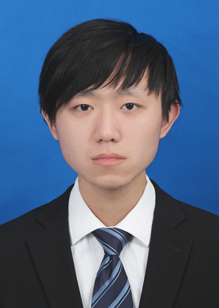

# Welcome to Huchenyang's Org

Hi, this is me, Huchenyang.

My name is huchenyang and I come from Yichang, Hubei province.

I graduated from Huazhong University of Science and Technology with an master's degree and major in mechanical engineering.

My favorite documentary is Machines-how they work which is produced by the Discovery channel.This documentary explain some work principle of machines .For example，in one episode,it talks about how a mechanical watch keep perfect time without a battery. The secret lies in an intricately wound spring that provides the power to the watch.

In my friend’s eyes, I am very humorous and easy-going，enjoying a good relationship among my friends. In my spare time, I like to watch documentaries.

